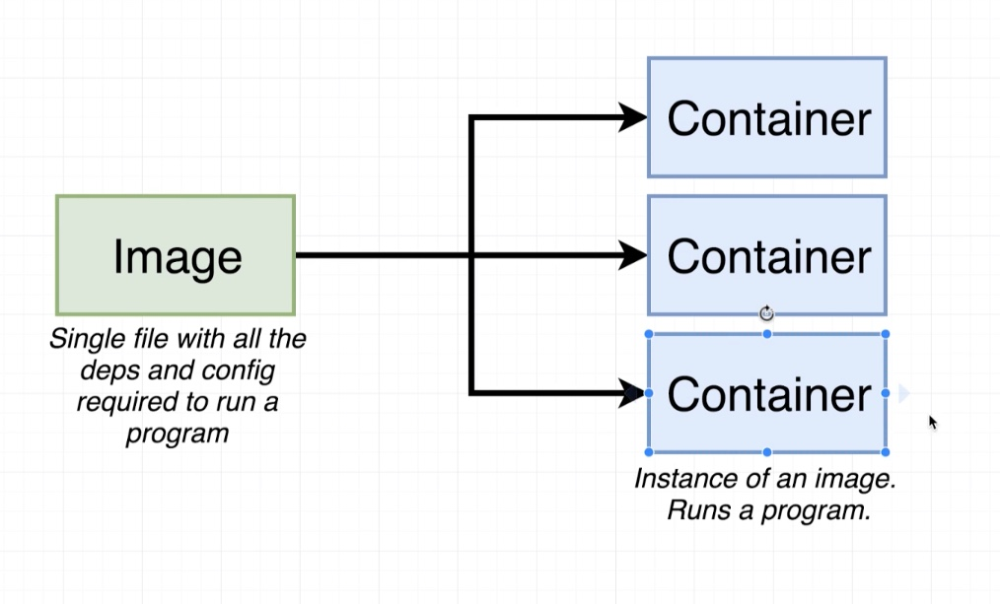
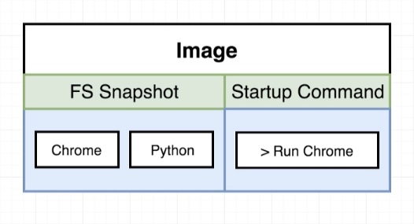
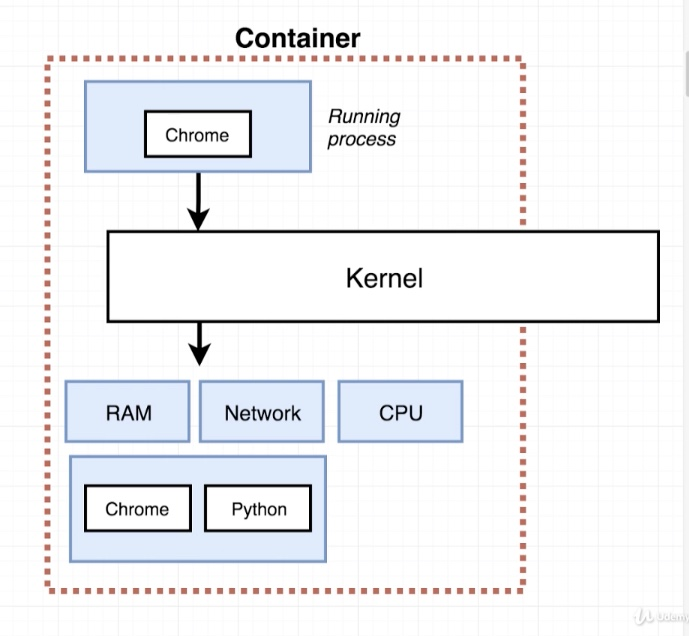

# **What is a Container?**

### A Container is a `singlular process` and a `grouping of resources` to an image.

&nbsp;

&nbsp;

# **What is an Image**?

### An Image is a `file system` snapshot with a very specific `startup command`.

&nbsp;

&nbsp;

 

&nbsp;

### **How the resources are then used:**

&nbsp;

