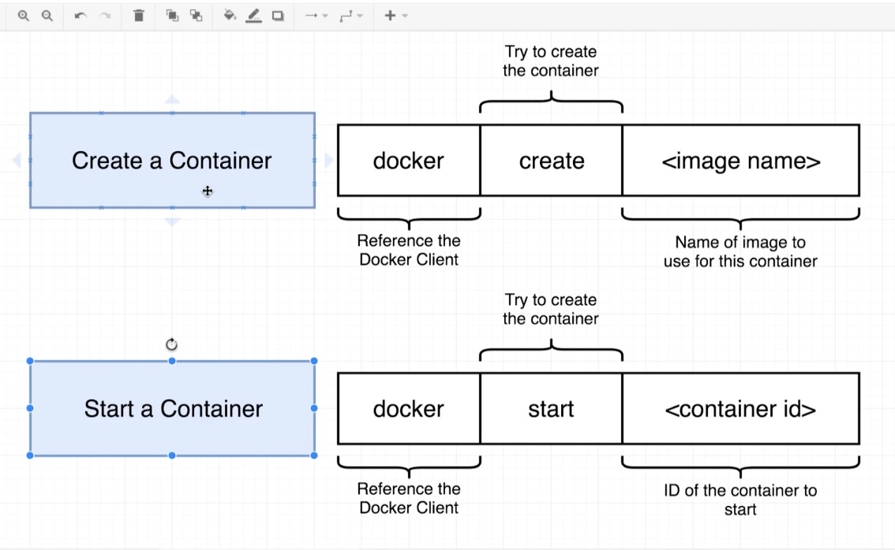
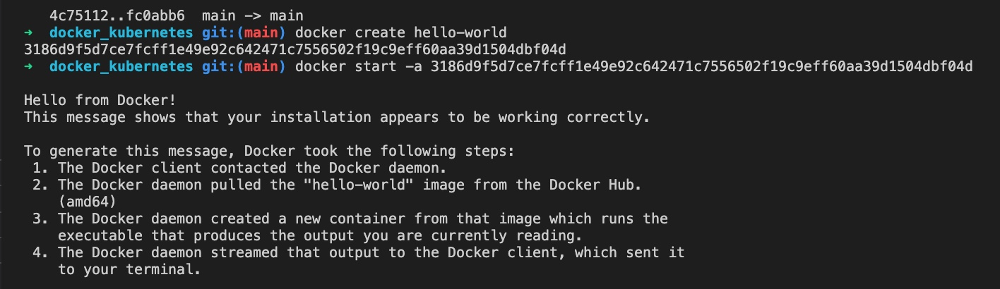

# **Docker Commands**

<kbd>docker ps</kbd> ~ Lists all `running` containers

<kbd>docker run busybox ping google.com</kbd> ~ Pings Google servers and measures amount of latency

<kbd>docker ps --all</kbd> ~ List all the containers ever created.

&nbsp;

### **Docker run is actually a composition of two separate commands**

&nbsp;

