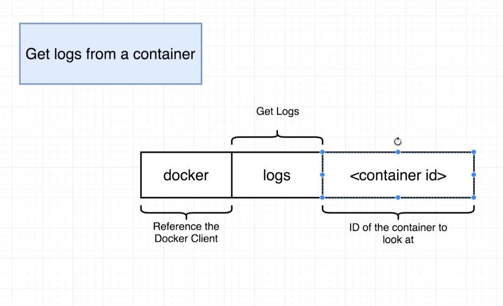
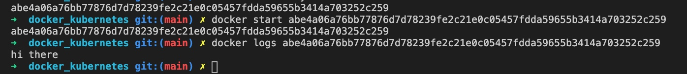
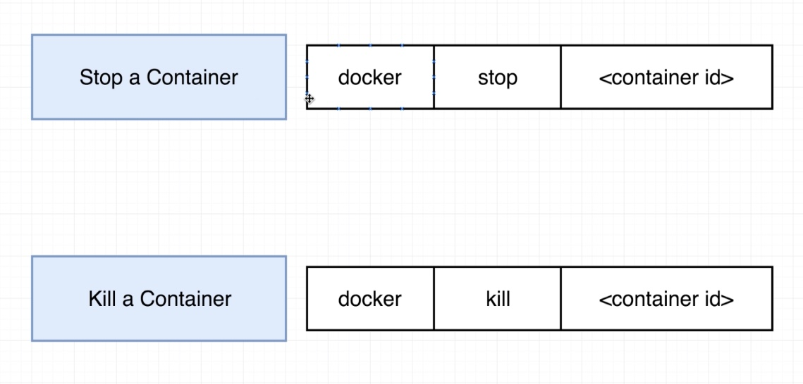
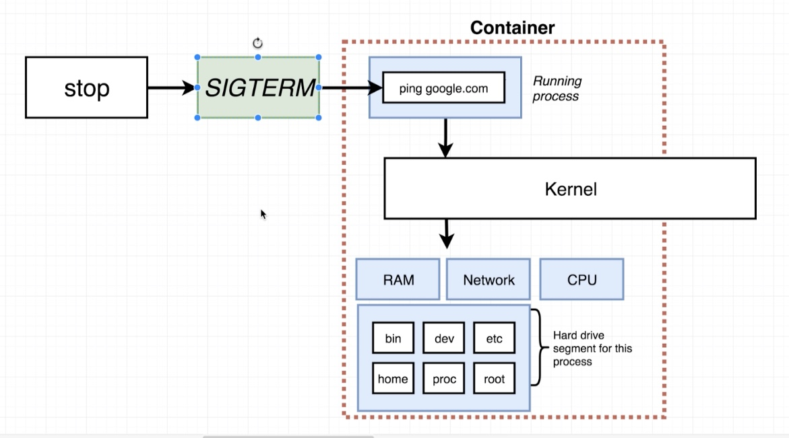

# **Docker Commands**

<kbd>docker ps</kbd> ~ Lists all `running` containers

<kbd>docker run busybox ping google.com</kbd> ~ Pings Google servers and measures amount of latency

<kbd>docker ps --all</kbd> ~ List all the containers ever created.

&nbsp;

### **Docker run is actually a composition of two separate commands**

&nbsp;

&nbsp;

Note: <kbd>-a</kbd> ~ Actually watches for output from the container and print it out
to the terminal. After a container has been exited, just use the id of the container
you want to run agian with the start command. 

&nbsp;

<kbd>docker system prune</kbd> ~ Deletes all stopped containers and caches.

&nbsp;

### **If we forgot to add the `-a` we can get around it with**

&nbsp;

&nbsp;

Note: One thing to keep in mind is that the container does not get ran again, we
just get a list of all the logs that have been emitted from the container. 

&nbsp;

### **Sometimes using <kbd>ping</kbd> or another command, we need to stop a container.** 
### **Without using cmd + c this can be achieved by**

&nbsp;

### **The difference between the two**

A hardware signal is sent to the primary process inside that container. This gives us
a little bit of time to do a little bit of cleanup by listening to this signal before
officially shutting down.

&nbsp;

### **Whereas**

Does not give any extra time to cleanup and the process is immediately shutdown